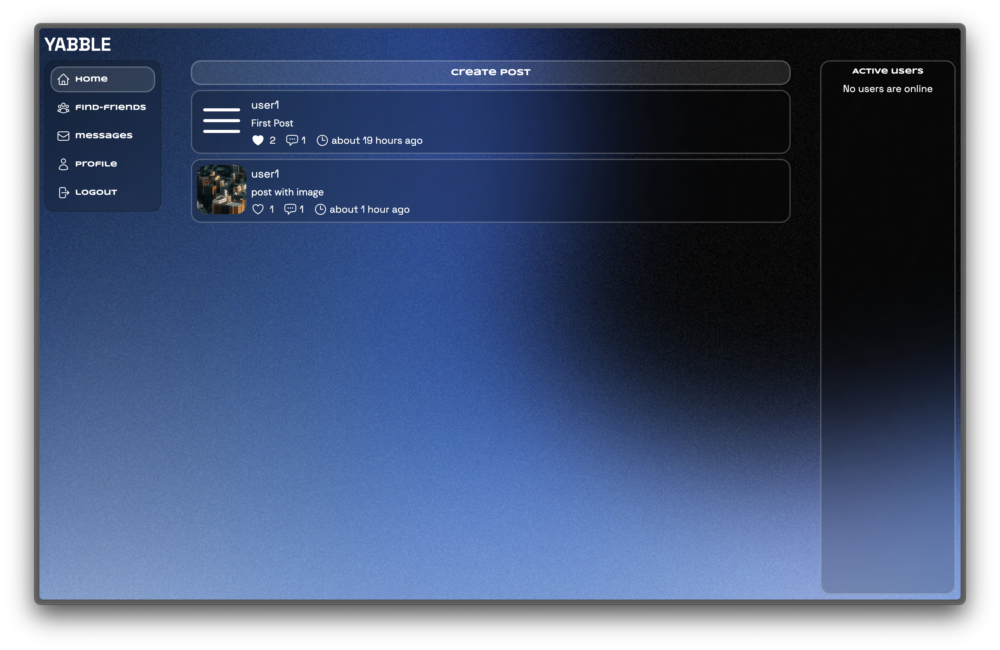
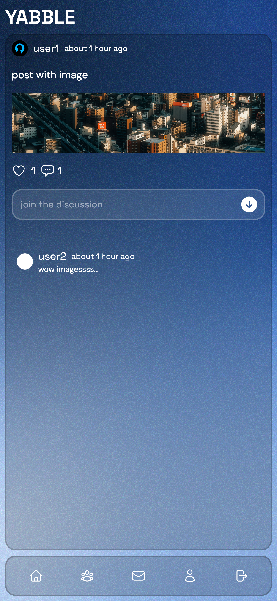
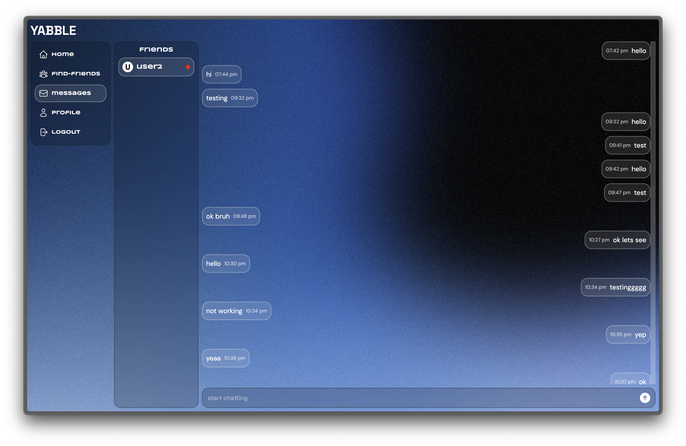
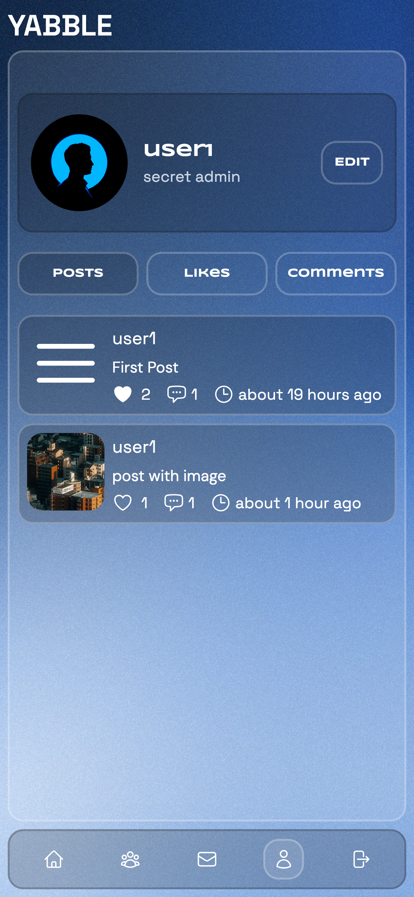

<h3 align="center">Yabble</h3>

  

      Yabble is a social media app where you can create and interact with posts from other users with other users. You can also send and receive friend requests from other users and can also DM them.This app uses RESTful APIs to connect with the backend server and it uses Socket.io for messages.
     
    <a href="https://yabble.vercel.app/">Live Demo</a>
  

 

<!-- ABOUT THE PROJECT -->

### Preview

<h4 align="center">Home Page</h4>
 
 <h4 align="center">Post page</h4>
 
  <h4 align="center">Messages page</h4>
 
<h4 align="center">User Profile</h4>
 

### API

This app uses Restful APIs to get / post / put for posts, adding comments. It uses socket.io for messages. The source code for the API can be found at <a href="https://github.com/notsanta20/yabble_api">ChatterBox API</a>

### Built With

<!-- ACKNOWLEDGMENTS -->

## Acknowledgments

- Inspiration by <a href="https://www.theodinproject.com/lessons/node-path-nodejs-odin-book">The Odin Project</a>
- Icons <a href="https://heroicons.dev/">Heroicons</a>
